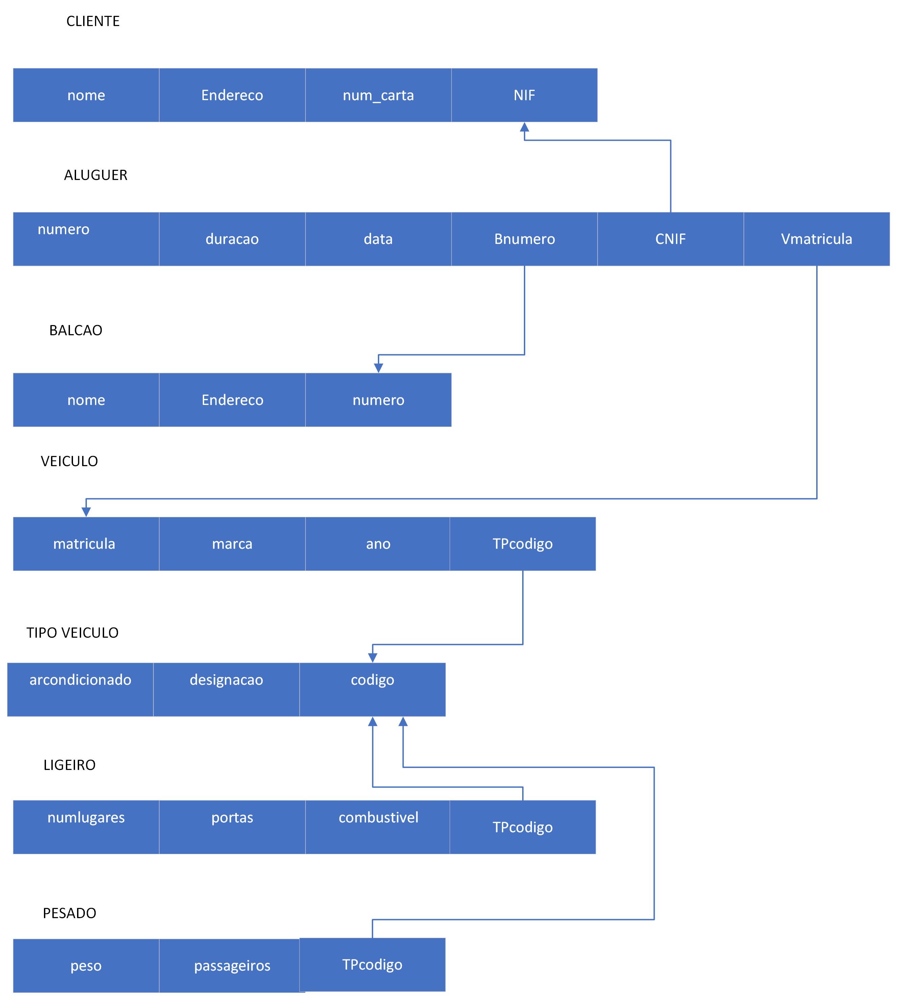
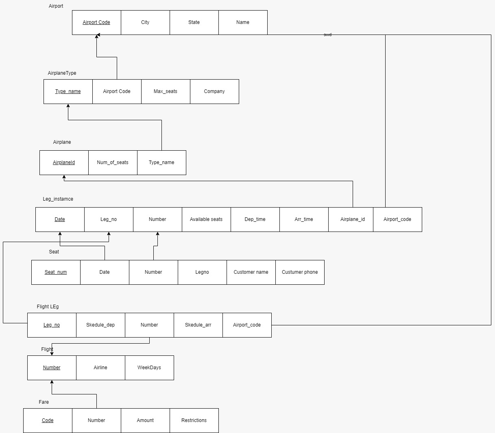
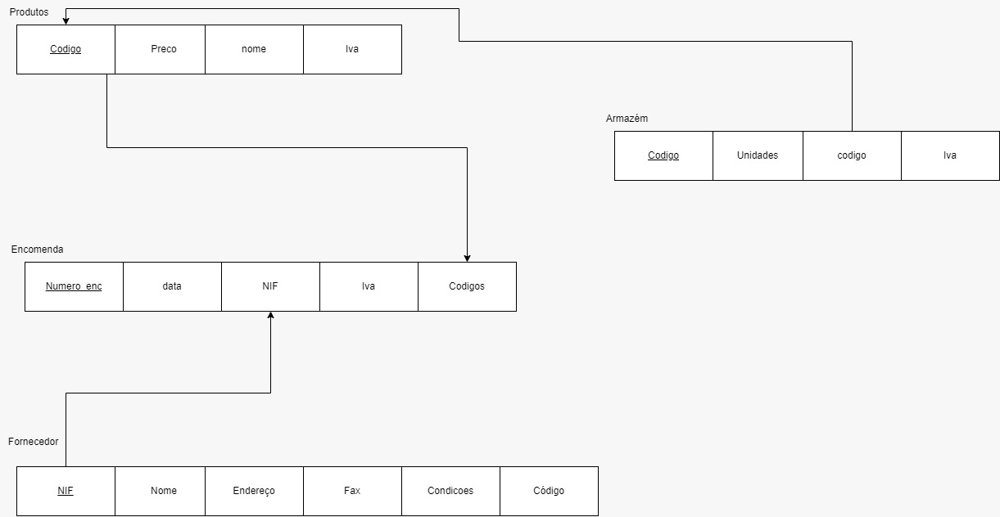
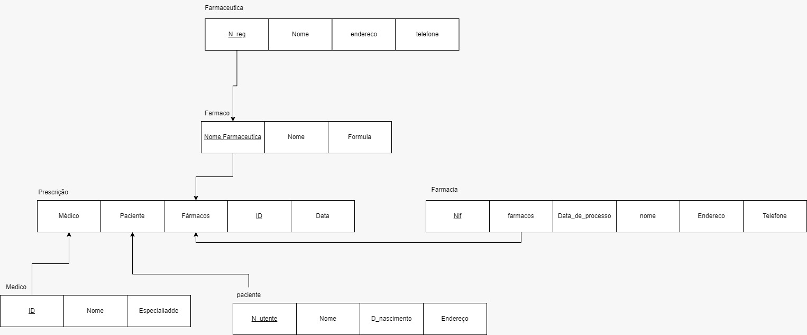
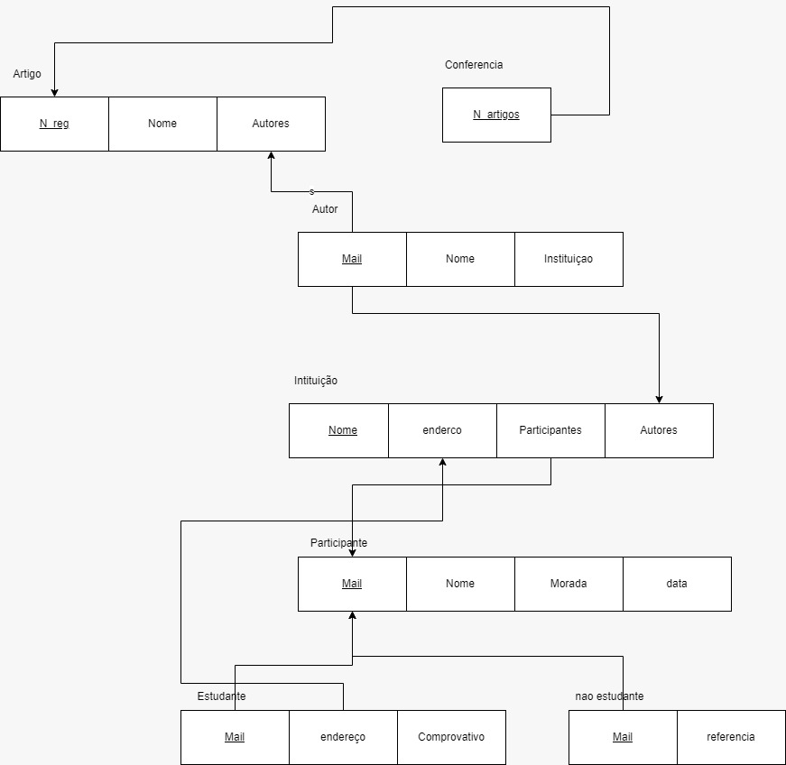
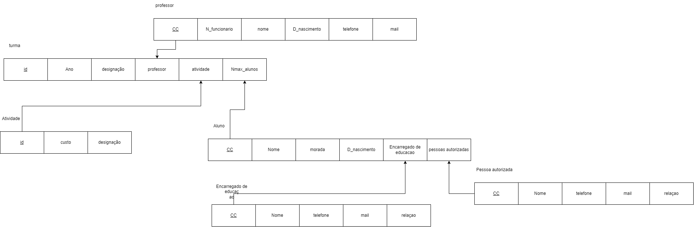

# BD: Guião 3


## ​Problema 3.1
 
### *a)*

```
Esquema de Relacoes:
Cliente(none, endereco, num_carta, NIF)
ALUGUER(numero, duracao, data, Bnumero, CNIF, Vmatricula)
BALCAO(nome, numero, endereco)
VEICULO(matricula, marca, ano, TPcodigo)
TIPO_VEICULO(designacao, arcondicionado, codigo)
LIGEIRO(TPcodigo, numlugares, portas, combustivel)
PESADO(TPcodigo, peso, passageiros)
RESERVATION(customer_name, Cphone)
Seat(seat_no)
FARE(code, amount, restrictions)
flight(number, airline, weekdays)
FLight_Leg(leg_no)
DEparts(Arr_time)
Arrives(DEp_time)
DEparture_Airport(scheduled_dep_time)
Arrival_airport(scheduled_arr_time)
```


### *b)* 

```
Cliente:
    chave candidatas:
    num_carta
    NIF

    chave Primaria:
    NIF

    chave Estrangeira:

ALUGUER:
    chave candidatas:
    CNIF
    Bnumero
    Vmatricula
    numero

    chave Primaria:
    numero

    chave Estrangeira:
    CNIF
    Bnumero
    Vmatricula

BALCAO:
    chave candidatas:
    enderenco

    chave Primaria:
    numero

    chave Estrangeira:

VEICULO:
    chave candidata:
    marca
    matricula
    TPcodigo

    chave Primaria:
    matricula

    chave Estrangeira:
    TPcodigo

TIPO_VEICULO:
    chave candidata:
    designacao
    codigo

    chave Primaria:
    codigo

    chave Estrangeira:

Ligeiros:
    chave candidata:
    TPcodigo

    chave Primaria:
    TPcodigo

    chave Estrangeira:
    TPcodigo

PESADO:
    chave candidata:
    TPcodigo

    chave Primaria:
    TPcodigo

    chave Estrangeira:
    TPcodigo

```


### *c)* 




## ​Problema 3.2

### *a)*

```
AIRPORT(Airpot_code, city, state, name)
AIRPORT_TYPE(Company, Type_name, max_seats)
AIRPLANE(Airplane_ID, Total_no_of_seats)
LEG_INSTANCE(No_of_avail_seats, Date)
SEAT(seat_no)
RESERvation

```


### *b)* 

```
... Write here your answer ...
```


### *c)* 




## ​Problema 3.3


### *a)* 2.1



### *b)* 2.2



### *c)* 2.3



### *d)* 2.4

